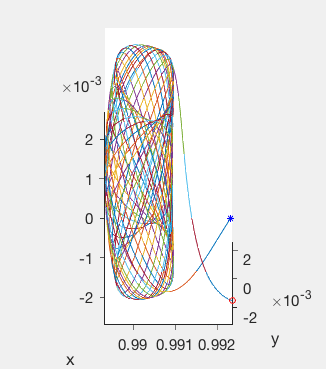

# In progress ...

# Multiple Shooting Method
A brief review of literatures can be found [here](multiple-shooting-method.md).

# Code Structure
| Name | Description |
| -----|-------------|
./ephemeris/ | Ephemeris dynamic model using [SPICE/MICE](https://naif.jpl.nasa.gov/naif/) toolbox; frame kernels for Earth-centered inertial and rotating frames.
./figs/ | some figures
./lissajous/ | generate Lissajous orbit
./lyapunov/ | Lyapunov orbit related
./halo/ | Halo orbit related
./rtbp/ | Restricted Three-Body Problem model related.
./Work_01_HaloInCRTBP_HaloShooting.m | Generate Halo orbit in Sun-Earth CRTBP model using third-order approximation and simple shooting method.
./Work_02_LissajousOrbit_multipleShooting.m | Generate Lissajous orbit in Sun-Earth CRTBP model using third-order approximation and multiple shooting method.
./Work_03_ephemeris_MultipleShooting.m | Generate Lissajous orbit in Earth-centered inertial (ECI) Ephemeris model using third-order approximation and multiple shooting method.
./MultipleShooting.m | multiple-shooting function
./PlotInitialState.m | Auxillary function to monitor shooting process. 

# Example Results

## Sun-Earth/Moon L1 Lissajous orbit multiple shooting

### L1 Lissajous orbit around Sun-Earth/Moon L1 point

|  |  |
|------------------------|---------|
| Third order approximation around L1 point --> CRTBP synodic frame. | Third order approximation around L1 point --> ECI Ephemeris --> Earth-centered Rotating frame. |
| Result of [./Work_02_LissajousOrbit_multipleShooting.m](Work_02_LissajousOrbit_multipleShooting.m) | Result of [./Work_03_ephemeris_MultipleShooting.m](Work_03_ephemeris_MultipleShooting.m) |
| 分了400段，各点位置精度1e-9，总速度精度1e-7，然后level 2用17次打靶完成，总共128秒 | 日地月星历下，同样的分了400段，各点位置精度10m，总速度精度0.1m/s，然后level 2用4次打靶完成，总共200秒，很快啊，不过这次开了4核8线程并行。|

# Todos
1. ode45 和 ode113 的算法比较来验证计算精度的设计 (easy, ~2017/12)
2. accept particular constraints described in Prof. Howell's publications. See more in multiple-shooting-method.md (unknown, ~2017/12)
    1. need to find a test example
2. add basic solar radiation model
2. fly-by problems
3. solve basic or simple low-thrust problems
3. automatically parse some critical input parameters
4. more testing examples
5. improve performance by benchmarking the performance
